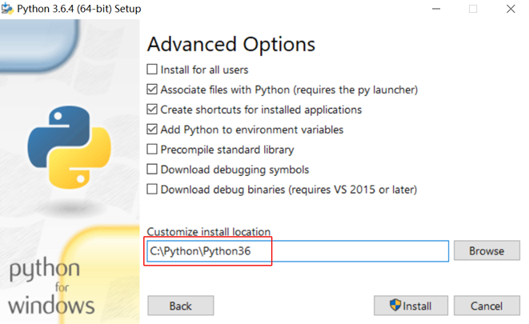

==================================
 编程环境安装
==================================

介绍
-----------

用户在 PC 上通过 WIFI、 USB 和 UART 跟 EP 建立连接后，可以使用明文 SDK 跟 EP 进行通信，进行更复杂的二次开发。在PC 上用户可以使用 C++、 C#、 Python 或是其他语言进行编程，这个可以按照用户开发能力自行决定。

为了让用户尽快熟悉 EP 的各个模块和功能，并方便使用本网站中的 Python 示例代码，我们介绍一下 Python 在 PC 上的安装步骤。

Windows 安装 Python
---------------------

**环境：** Windows 10 64 位，Python 3.6.4

1. 从 `python 官网上 <https://www.python.org/downloads/>`_ 找到 3.6.4 的安装包，选择下载文件进行下载。

.. image:: ./images/win10_python_setup1.png

2. 双击下载好的安装文件，然后“下一步”就可以，需要注意的是我们选择自定义安装并勾选自动添加环境变量。

.. image:: ./images/win10_python_setup3.png

3. 接着“下一步”，手动选择安装路径。

4. 安装完成后按 ``win+r`` 输入 ``cmd`` 打开命令提示符界面，在命令行里面输入 ``python -V``, 确认 Python 3.6 安装成功。

Ubuntu 安装 Python
---------------------

**环境：** ubuntu 16.04 64 位，Python 3.6.3

1. Ubuntu16.04 默认安装了Python2.7和3.5，请注意，系统自带的python千万不能卸载。输入命令 ``python -V``，可以查看 Python 默认版本。

2. 输入如下命令安装 python 3.6 软件包：

::

	sudo add-apt-repository ppa:jonathonf/python-3.6
	sudo apt-get update
	sudo apt-get install python3.6

3. 调整 Python3 的优先级，使得 Python 3.6 优先级较高。

::

		sudo update-alternatives --install /usr/bin/python3 python3 /usr/bin/python3.5 1
		sudo update-alternatives --install /usr/bin/python3 python3 /usr/bin/python3.6 2
		sudo update-alternatives --install /usr/bin/python python /usr/bin/python2 100
		sudo update-alternatives --install /usr/bin/python python /usr/bin/python3 150

4. 此时再输入命令 ``python -V`` ，确认 Python 3.6 安装成功。