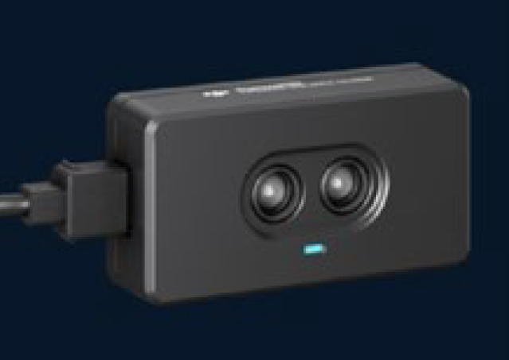

================
红外深度传感器
================

介绍
----------

红外深度传感器的设计是基于飞行时间 TOF (Time of Flight) 原理，即传感器发出经调制的近红外光，遇物体后反射，传感器通过计算光线发射和反射时间差或相位差，来计算距离物体的距离。

产品特性
----------

红外深度传感器的探测面积见下图：

.. image:: ../images/tof.png

其发出的是一个角度为 20° 的圆锥光，这个光斑 D 与距离 Dist 的关系：

    **D=2×Dist×tan⁡(10)**

要实现最佳测试效果，应保证目标物的尺寸要至少等于 TOF 光斑的尺寸。
 
.. tip:: 如果目标物小于光斑大小，那么应保证目标物尽量在光斑的中心位置，因为光斑内的光强分布并不是均匀的，而是呈一个类高斯分布，中间光强大，四周光强小，为了保证返回光能量足够，应尽量保证目标物在光斑中心。

引脚说明
----------

这里介绍红外深度传感器的UART口：

====== ======= ====== ===========
编号    引脚    功能   对应连接项
====== ======= ====== ===========
1	VCC	供电	电源正极
2	GND	供电	电源地
3	TX	发送	RX
4	RX	接收	TX
====== ======= ====== ===========

通讯协议和数据格式
-------------------

========= ====== ====== ====== ==========
通讯接口  波特率 数据位 停止位  奇偶校验
========= ====== ====== ====== ==========
UART      115200   8      1     none
========= ====== ====== ====== ==========

控制命令输入:

.. data:: ir_distance_sensor_measure_on

	:描述: 打开红外深度传感器数据输出，输出频率为20 Hz
	

.. data:: ir_distance_sensor_measure_off

	:描述: 关闭红外深度传感器数据输出
	

数据输出:

.. data:: ir distance:xxx

	:描述: 红外深度传感器数据格式
	
.. tip:: 命令格式都以字符串形式输入和输出

Python API
--------------------------

请参考 :doc:`红外深度传感器<../python/ir_distance_sensor>`
