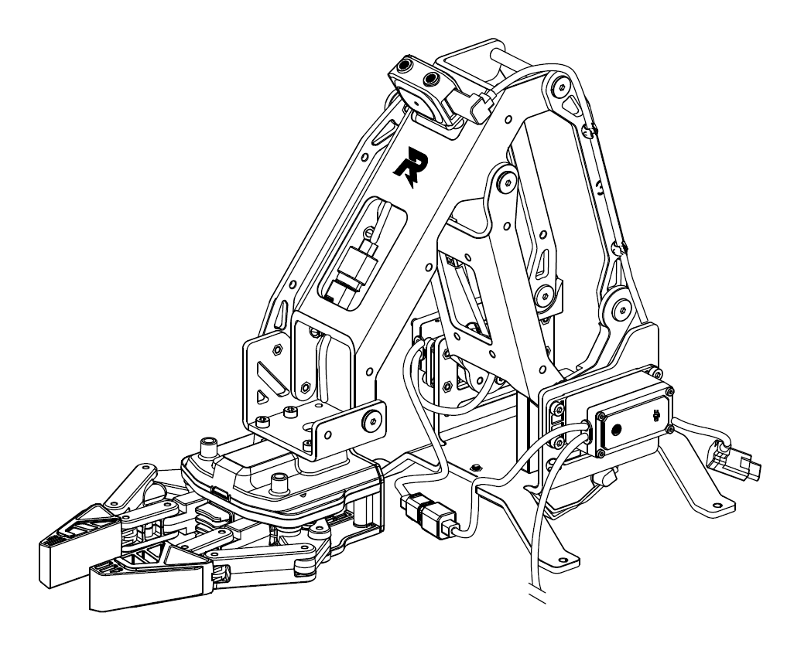

================
机械臂与机械爪
================

介绍
----

机械臂支持 FPV 精准遥控，机械爪配合机械臂使用，支持夹力控制，用户可在 App 中通过第一人称视角操控机械臂和机械爪完成任务。

使用说明
--------

用户可以控制机械臂的移动范围、机械爪的开合距离。其中，机械臂的水平移动范围为 0-0.22 米，垂直移动范围为 0-0.15 米；机械爪的开合距离约为 10 厘米。

.. warning::
	1.当机械臂或机械爪处于工作状态时，请尽量避免对其施加外力。

	2.请勿碰撞或损伤机械臂或机械爪，避免导致性能下降或舵机运行异常。

	3.避免因用身体部位接触机械臂或机械爪旋转或尖锐部分而导致受伤。

	4.及时清理水滴、水晶弹残渣等异物，避免腐蚀结构表面。
	
机械爪PWM 接口说明:
^^^^^^^^^^^^^^^^^^^

机械爪支持力矩控制模式

.. image:: ../images/arm_pwm.png
	:scale: 20%

+----------+------------+  
|   序号   |    引脚    |   
+==========+============+
|    1     |  485A/PWM  |  
+----------+------------+
|    2     |    485B    |  
+----------+------------+  
|    3     |  VCC-12V   | 
+----------+------------+
|    4     |    GND     |  
+----------+------------+

PWM 信号为50Hz，占空比为2.5%~12.5%。

1. 2.5%~7.5% 占空比对应闭合力度[ 最大，0];

2. 7.5%~12.5% 占空比对应开合力度[0，最大]。

Python API
--------------------------

请参考 :doc:`机械臂<../python/robotic_arm>` 和 :doc:`机械爪<../python/gripper>`
