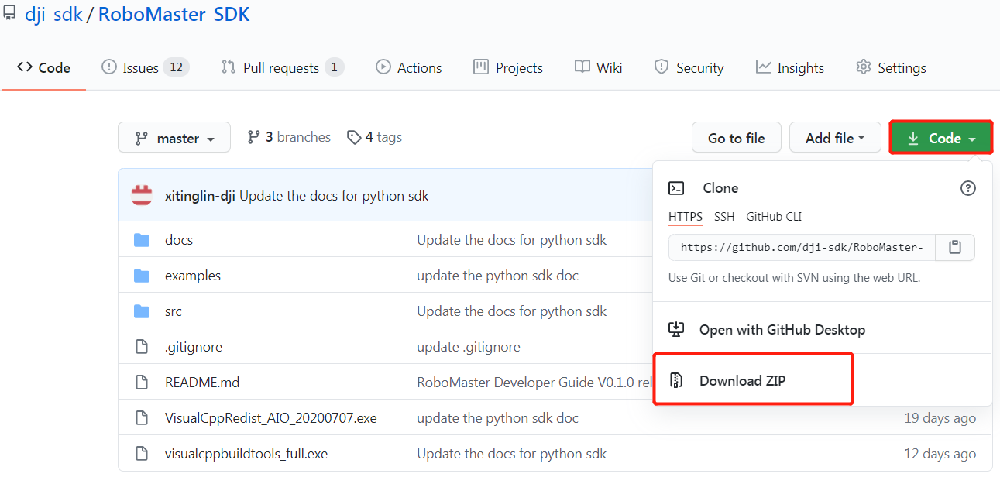
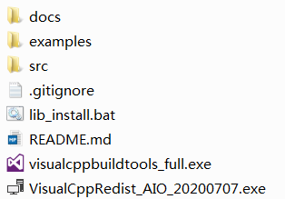
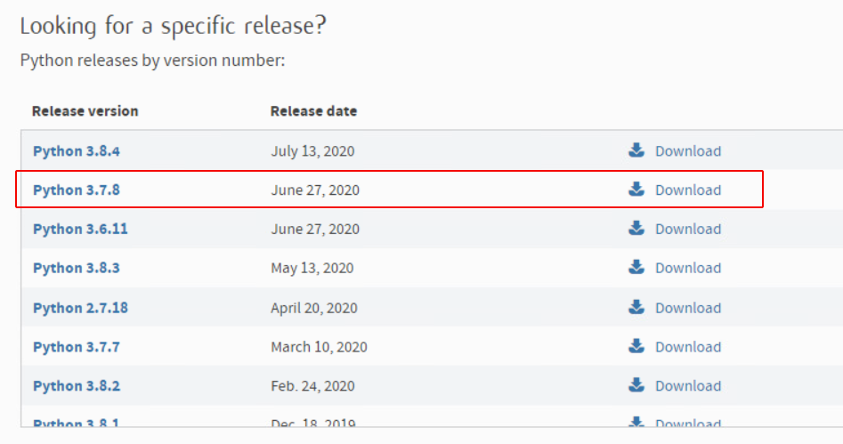
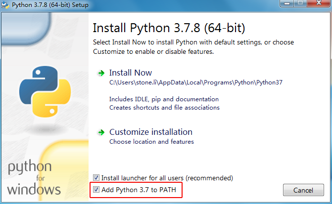
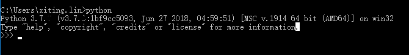
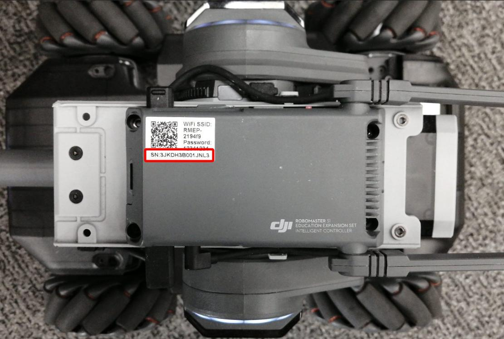
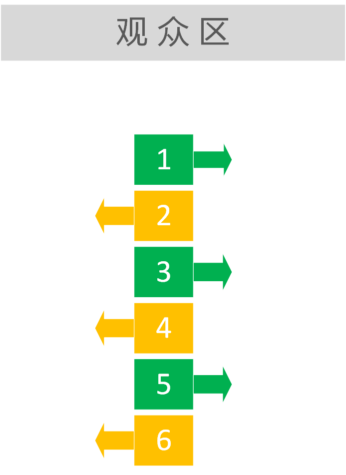

.. _multi_robot_EP:

###############################
RoboMaster SDK 多机编队EP
###############################

这里以window 64位为例，介绍robomaster SDK的EP编队教程：

Demo的环境要求及物料清单
--------------------------

1. **编程环境**

（1）下载RoboMaster-SDK压缩包，Github下载链接：`RoboMaster-SDK压缩包 <https://github.com/dji-sdk/RoboMaster-SDK/>`_ (备用Gitee下载链接：`RoboMaster-SDK压缩包 <https://gitee.com/xitinglin/RoboMaster-SDK>`_)，下载步骤：

* 点击 ``Code`` ,点击 ``Download ZIP`` 下载压缩包。

* 解压下载完的RoboMaster-SDK-master.zip压缩包：

* 压缩文件包含：

	1.VS相关运行库： **VisualCppRedist_AIO_20200707.exe**

	2.VS build tool:  **visualcppbuildtools_full.exe**

	3.RoboMaster SDK示例代码:  **examples**

	4.第三方库安装脚本： **lib_install.bat**

（2）安装必要的VC库：

运行RoboMaster-SDK压缩包中的 **VisualCppRedist_AIO_20200707.exe** ，并完成安装：

.. image:: ./../images/vc_exe.png

.. warning:: 不安装VC库，使用SDK，会引起以下问题:

	.. image:: ./../images/libmedia_err.png

（3）安装VS Build Tool：

运行RoboMaster-SDK压缩包中的 **visualcppbuildtools_full.exe** ，并完成安装：

.. image:: ./../images/vs_build_tool.png

（4）python环境安装：

a. 从 `python 官网上 <https://www.python.org/downloads/windows/>`_ 找到可以下载的安装包，以Python3.7.8 为例，选择安装文件进行下载。

.. warning:: 请确保下载的 `python.exe` 是64位的，python sdk适配3.6.6以上python版本，否则会影响python sdk的使用，如果电脑上已经安装了python环境，建议卸载重新安装。

b. 步骤（1）：确认安装包版本是 ``64-bit``, 否则会影响Python sdk使用。

   步骤（2）：勾选 ``Add Python 3.7 to Path``。

   步骤（3）：选择 ``Install Now`` 进行安装，如下图所示。

c. 安装完成后按 ``win+r``，在弹出窗口中输入 ``cmd`` 打开命令提示符界面，在命令行里面输入 ``python``, 确认 Python 3.7.8 安装成功。

（5）python第三方依赖库安装：

    方法一：在下载的RoboMaster-SDK压缩包目录(:file:`RoboMaster-SDK-master/lib_install.bat` )中找到lib_install.bat文件，鼠标右键单击该文件，选择以管理员身份运行即可。

    方法二：安装RoboMaster SDK，点击电脑开始菜单，在搜索框中输入 ``cmd`` ，在搜索结果中，对着命令提示符程序，单击鼠标右键，菜单中点击选择 ``以管理员身份运行`` ,并依次输入以下指令::

		pip install robomaster
		pip install netaddr
		pip install netifaces
		pip install myqr

2. **EP小车**

- 数量：6台EP步兵车

.. tip:: 如果没有6台EP小车，2台EP小车也可以，后面的示例代码请更换参考 :file:`/examples/15_muti_robot/multi_ep/02_two_ep_demo.py`

- 固件版本：01.01.0500

.. tip:: 固件版本升级可以通过Robomaster App进行，确保固件版本号在01.01.0500及以上版本。

EP组网连接
----------------
步骤1：首先将每台EP机器人设置为路由器组网模式并将电脑与机器人加入到同一个局域网内，实现组网连接

如下图所示：

.. image:: ./../images/networking_connection_change.png
            :align: center

步骤2：生成二维码

- 参考下载的RoboMaster-SDK压缩包目录下的示例代码 :file:`/examples/01_robot/05_sta_conn_helper.py` 目录下的例程

.. literalinclude:: ./../../../examples/01_robot/05_sta_conn_helper.py
   :language: python
   :linenos:
   :lines: 17-

.. warning:: 示例代码13行中的：

		info = helper.build_qrcode_string(ssid="RoboMaster_SDK_WIFI", password="12341234")

		`ssid` （路由器名称）和 `password` (路由器密码)，需要根据实际的路由器信息进行填写

- 运行示例代码，会出现二维码图片，按下机器人智能中控上的扫码连接按键，扫描二维码进行组网连接。

	.. image:: ./../images/networking_connection_key.png
            :align: center

- 运行结果::

    Connected!

同时机器人的灯效变为白色呼吸变为青绿色常亮。

.. note:: 一共6台EP小车需要连接WiFi，首次逐个连接6台EP小车时，连接每台小车都要重复运行示例代码，连接完成后，下次重启小车时会自动连接。

运行多机编队示例代码
--------------------------------------

- 参考下载的RoboMaster-SDK压缩包目录下的示例代码 :file:`/examples/15_muti_robot/multi_ep/03_six_ep_demo.py` 目录下的例程

1. 待每台机器人连接同一个路由器成功后，需手动修改示例代码中的机器人SN编号，每台机器人的SN编号位于智能中控的标签中，如下图所示：

2.编辑示例代码，找到示例代码的203行：

	.. literalinclude:: ./../../../examples/15_multi_robot/multi_ep/03_six_ep_demo.py
	   :language: python
	   :linenos:
	   :lines: 203-204

	根据机器人的SN依次修改示例代码里的SN。

3. 根据6个SN的顺序，依次按照下图摆放6台机器人，箭头方向为机器人朝向。

运行修改后的示例程序
----------------------

- 打开 :file:`/examples/15_muti_robot/multi_ep/` 目录，按住键盘shift，然后再目录任意空白处单击鼠标右键，单击选择 “在此处打开Powershell窗口” ，或 “在此处打开命令窗口”

- 运行代码,命令窗口输入::

	python 03_six_ep_demo.py
