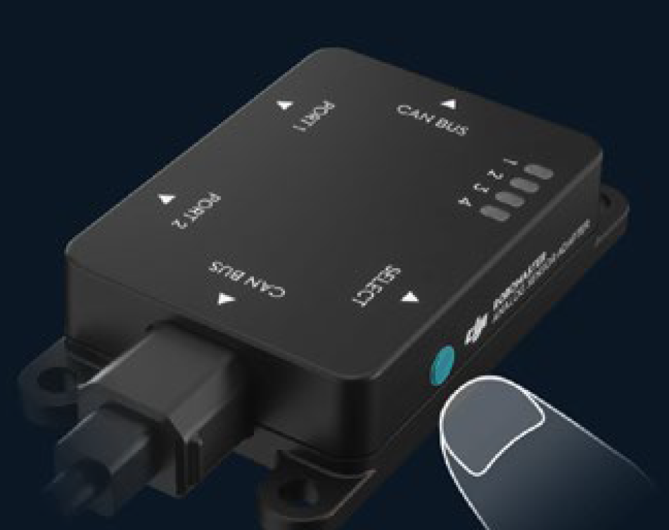

================
传感器转接模块
================

介绍
----------

传感器转接模块是为了方便用户将温度、压力、测距等传感器接入 RoboMaster EP而设计的，可在Scratch 编程环境中获取传感器数据信息，每个模块均有两个传感器接口，两个接口功能相同。

引脚说明
----------

+----------+------------+------------------------------+   
|   端口   |    引脚    |              功能            |   
+==========+============+==============================+   
|   port1  |    VCC     |   电源正极，输出电压3.3V     |   
+          +------------+------------------------------+    
|          |    GND     |          电源地              |   
+          +------------+------------------------------+   
|          |    I/O     |   电平输入，输入范围0~3.3V   |   
+          +------------+------------------------------+ 
|          |    AD      | 模拟电压输入，输入范围0~3.3V |   
+----------+------------+------------------------------+ 
|   port2  |  同Port1   |          同port1             |   
+----------+------------+------------------------------+

Python API
--------------------------

请参考 :doc:`传感器转接模块<../python/sensor_adapter>`
