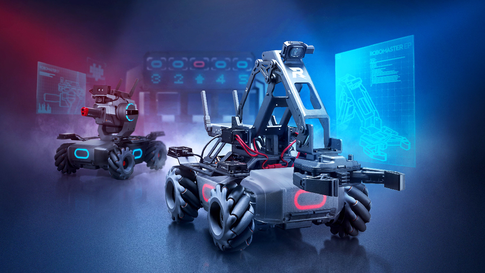

==================================
 欢迎来到 RoboMaster 开发者页面
==================================

.. toctree::
    :maxdepth: 0
    :caption: 快速开始
    :numbered:

    introduction.rst
    code_env_setup.rst
    third_part_comm.rst

.. toctree::
    :maxdepth: 0
    :caption: 拓展模块/拓展接口说明
    :numbered:

    extension_module/robotic_arm_and_gripper.rst
    extension_module/servo.rst
    extension_module/ir_distance_sensor.rst
    extension_module/sensor_adapter.rst
    extension_module/uart.rst

.. toctree::
    :maxdepth: 0
    :caption: SDK 说明
    :numbered:

    sdk/sdk_intro.rst
    sdk/connection.rst
    sdk/api.rst

.. toctree::
    :maxdepth: 0
    :caption: Python 编程说明
    :numbered:

    python/python_intro.rst
    python/python_feature.rst
    python/python_api.rst

.. toctree::
    :maxdepth: 0
    :caption: 示例程序

    demo/form_ctrl.rst

.. toctree::
    :maxdepth: 0
    :caption: 版本说明

    version.rst

Indices and tables
==================

* :ref:`genindex`
* :ref:`modindex`
* :ref:`search`
